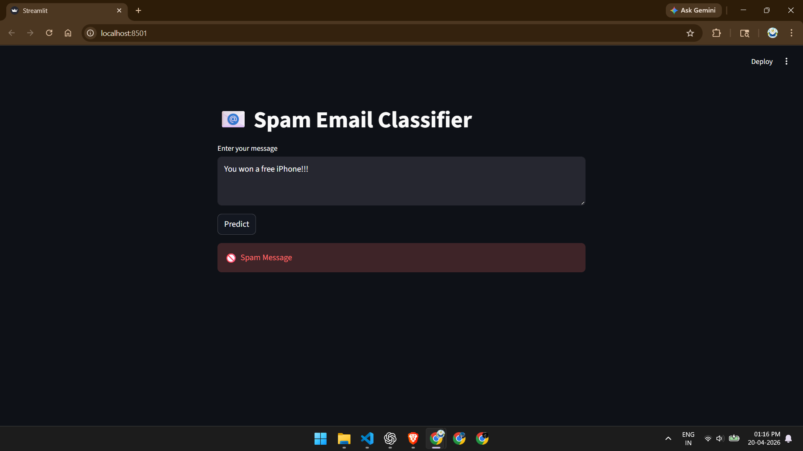

# 📧 Spam Email Classifier

## 🚀 Overview

This project is a machine learning-based spam classifier that detects whether a message is spam or not using NLP techniques.

## 🧠 Tech Stack

* Python
* Scikit-learn
* TF-IDF Vectorization
* Naive Bayes
* Streamlit

## 📊 Results

* Naive Bayes Accuracy: **97%**
* Logistic Regression Accuracy: **96%**

## ⚙️ Features

* Text preprocessing and vectorization
* Model training and evaluation
* Real-time prediction using Streamlit

 ## 📸 App Screenshot



Streamlit-based user interface for real-time spam detection, powered by a TF-IDF vectorizer and Naive Bayes model trained on labeled text data. 

## ▶️ Run Locally

```bash
pip install pandas scikit-learn streamlit
streamlit run app.py
```

## 💡 Example

* "Win a free iPhone now!!!" → Spam
* "Let's meet tomorrow" → Not Spam

## 👤 Author

Kumar Sai
